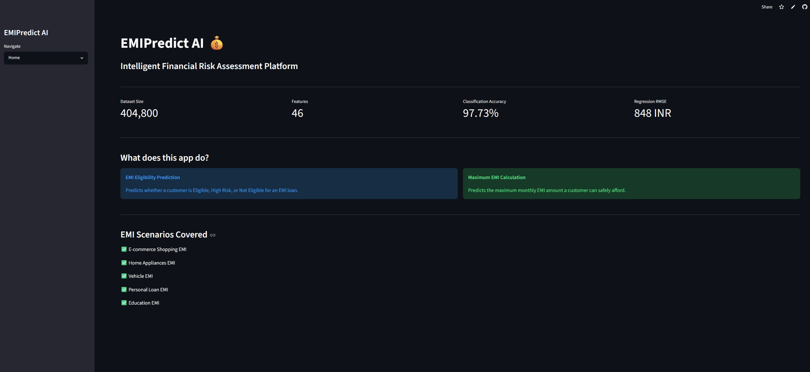
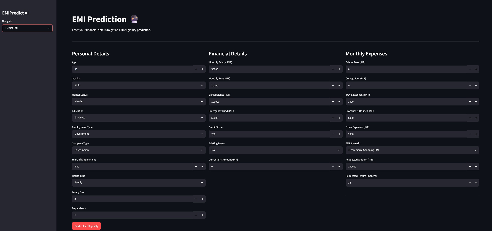
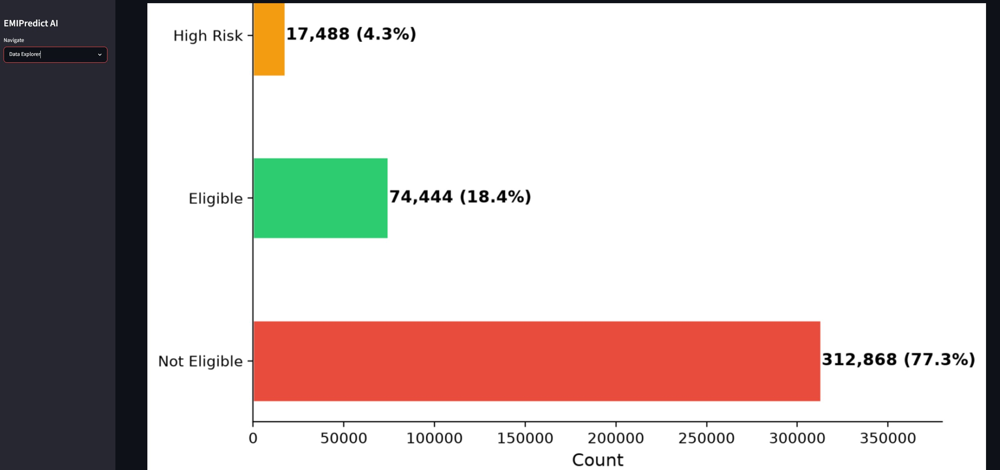
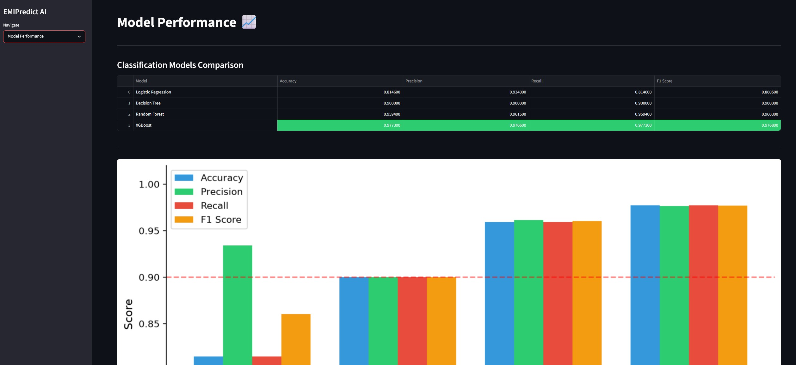

# EMIPredict AI 💰
### Intelligent Financial Risk Assessment Platform

## Overview
EMIPredict AI is a machine learning web application that predicts EMI loan eligibility and maximum affordable EMI amount for customers across 5 lending scenarios.

## Live Demo
🔗 [EMIPredict AI App](https://emipredict-ai-8palm37otxndfzumufbldh.streamlit.app/)

## Problem Statement
People struggle to pay EMI due to poor financial planning and inadequate risk assessment. This platform provides data-driven insights for better loan decisions.

## Application Screenshots

### Home Page

### EMI Prediction

### Data Explorer

### Model Performance

## Features
- ✅ EMI Eligibility Prediction (Eligible / High Risk / Not Eligible)
- ✅ Maximum Monthly EMI Calculation
- ✅ Interactive Data Explorer
- ✅ Model Performance Comparison

## Dataset
- 400,000 financial records
- 22 input features
- 5 EMI scenarios (E-commerce, Home Appliances, Vehicle, Personal Loan, Education)

## Machine Learning Models

### Classification (EMI Eligibility)
| Model | Accuracy | F1 Score |
|---|---|---|
| Logistic Regression | 81.46% | 86.05% |
| Decision Tree | 90.00% | 90.00% |
| Random Forest | 95.94% | 96.03% |
| **XGBoost ✅** | **97.73%** | **97.68%** |

### Regression (Max Monthly EMI)
| Model | RMSE | R² |
|---|---|---|
| Linear Regression | ₹4,080 | 0.72 |
| Random Forest | ₹985 | 0.98 |
| **XGBoost ✅** | **₹848** | **0.99** |

## Tech Stack
- **Data Processing:** Python, Pandas, NumPy
- **Machine Learning:** Scikit-learn, XGBoost
- **Experiment Tracking:** MLflow
- **Web Application:** Streamlit
- **Deployment:** Streamlit Cloud
- **Version Control:** GitHub

## Project Structure

EMIPredict-AI/

├── app.py                  # Streamlit application

├── Dataset_process.ipynb   # Step 1: Data preprocessing

├── EDA.ipynb               # Step 2: Exploratory data analysis

├── FE.ipynb                # Step 3: Feature engineering

├── Model_training.ipynb    # Step 4: Model training

├── requirements.txt        # Dependencies

└── .gitignore

## Key Findings
- Dataset is highly imbalanced (77% Not Eligible)
- Monthly salary is the strongest predictor of eligibility
- Eligible customers earn 54% more than Not Eligible (₹72,600 vs ₹47,100)
- Government employees have the highest approval rate (25%)
- Bank balance and emergency fund are highly correlated (0.89)

## Author
Ramesh krishna 
